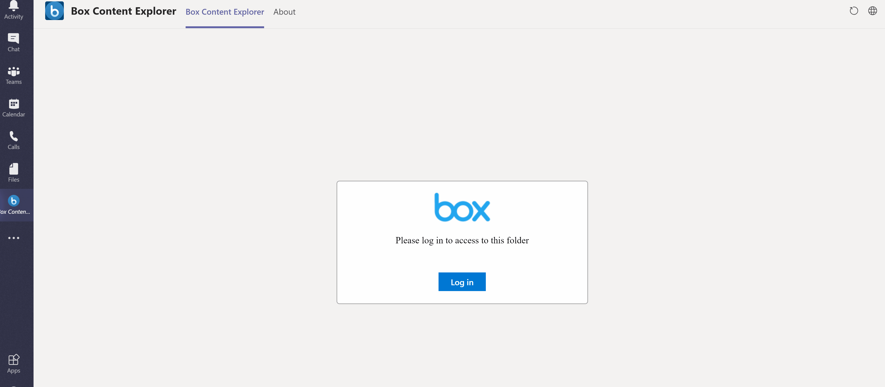

# Summary

This sample shows how you can implement OAuth 2.0 flow inside Microsoft Teams Tab using the SharePoint Framework and the Teams Client SDK. Please read [this blog post](https://ramin.expert/?p=334) to get more information how I implemented this solution.

